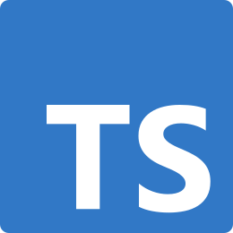
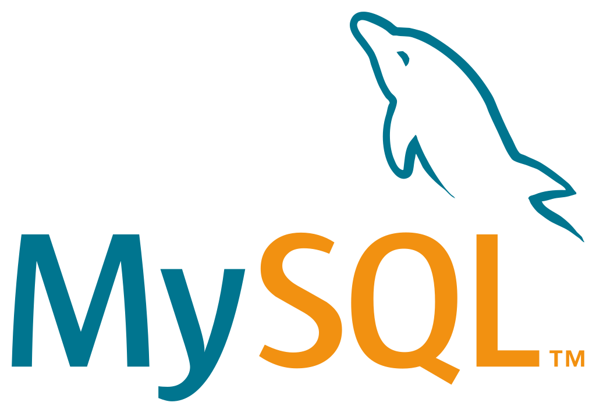

### hello there :-)

 

Hello. I'm [Ayam Banjade](https://www.ayambanjade.com.np/), a CS student. I am an open-source enthusiast and enjoy learning/trying out new things, whether cutting-edge or just something I want to try.

I like Vim (particularly Neovim) and LaTeX. I love music, playing sports, and the command line. I take great care of maintainability, readability, code quality, and relevant architecture.

### Languages / Frameworks / Tools

  <code>  </code>
  <code> </code>
  <code> </code>
  <code> </code>
  <code> </code>
  <code> </code>
  <code> </code>
  <code> </code>
  <code> </code>
  <code> </code>
  <code> </code>
  <code> </code>
  <code> 
    <picture>  
      <source media="(prefers-color-scheme: dark)" srcset="./assets/nextjs-dark.png"> 
      <source media="(prefers-color-scheme: light)" srcset="./assets/nextjs-light.png"> 
       
    </picture>
  </code>

<code>  </code>
<code>  </code>
<code>  </code>
<code>  </code>

