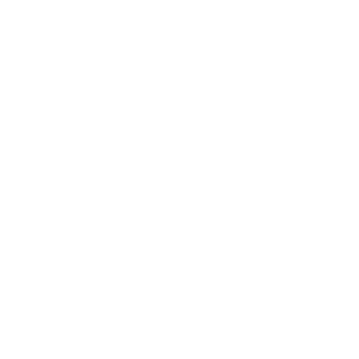

### I'm Ayam Banjade :-D

I like vim and LaTeX. I love the command line :p.

Some things I know:

  
  
  
  
  
  
  
  
  
  
  
  
  
  

You can see my resume and projects on my [Personal Portfolio](https://brainteazer.github.io/)
You can find me on [Linkedin](https://www.linkedin.com/in/ayambanjade)
